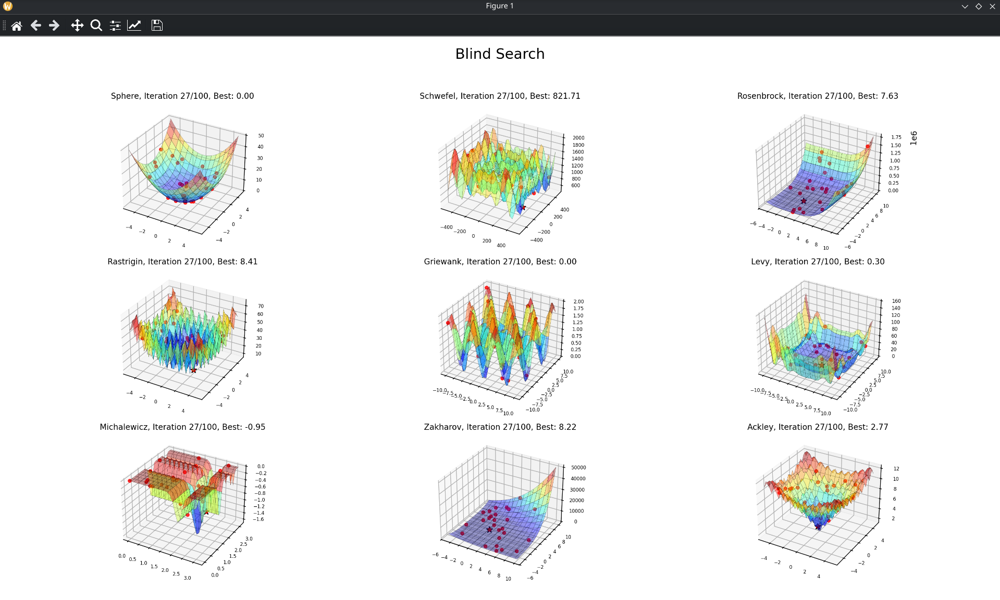
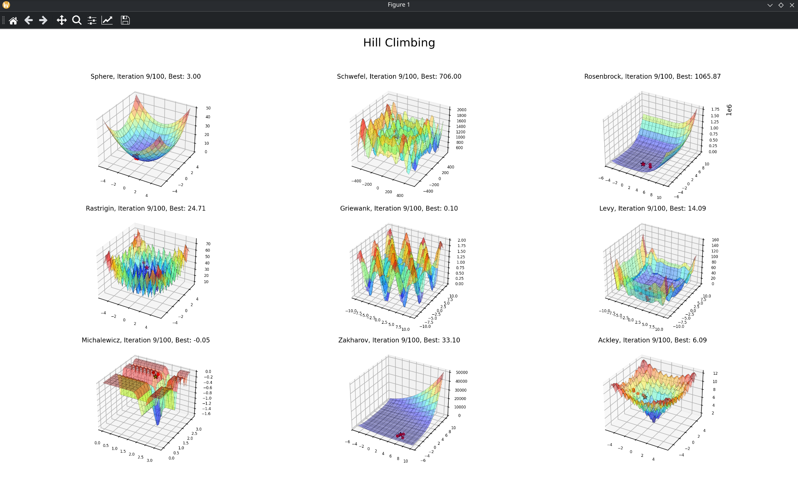

Explanation of setup:

- `functions.py` defines the functions.
- `plot.py` defines the matplot impl that plots the functions.
- `cvX.py` the lesson-specific script.

How to run (after setupping venv & requirements):

# CV1

```bash
python cv1.py
```

For each learning algorithm should look something like this:




- It is animated
- Limited to N iterations (hardcoded in code)
- After closing the window, the new algorithm should appear on all of the functions.

Algorithms implemented:
- Blind Search
- Hill Climb
- Tabu Search (I think this was not needed, but i did FF)
