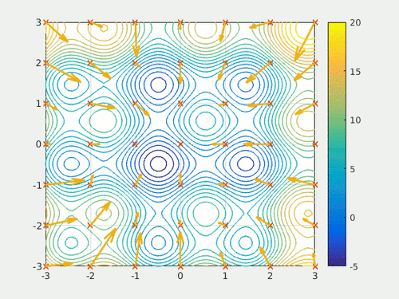
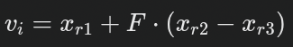

## PSO – Particle Swarm Optimization (Optimalizace rojem částic)

Inspirováno kolektivním chováním (např. hejna ptáků nebo ryb).

Každá částice má pozici (možné řešení) a rychlost, kterou se pohybuje v prostoru řešení.

Pohyb se řídí kombinací:

osobní zkušenosti částice (její nejlepší nalezená pozice),

kolektivní zkušenosti (nejlepší pozice nalezená celým rojem),

a často i momentem (udržení směru pohybu – tzv. "inertia weight").

## DE – Differential Evolution (Diferenciální evoluce)

Vyvíjí populaci řešení pomocí mutace a křížení.

Nové řešení vzniká jako kombinace rozdílů mezi náhodně vybranými jedinci:

F je váhový faktor (obvykle 0.4–1.0).

Poté se aplikuje křížení s původním řešením a selektivně se vybere lepší jedinec.

## NSGA-II

- Chceme najednou minimalizovat:
  - S (plášť)
  - T (celkovou plochu)
- -> Je to vice cilu najednou -> multikriterialni -> hledani kompromisu
- Každá modrá tečka = jeden kužel, který algoritmus našel jako velmi výhodný kompromis.